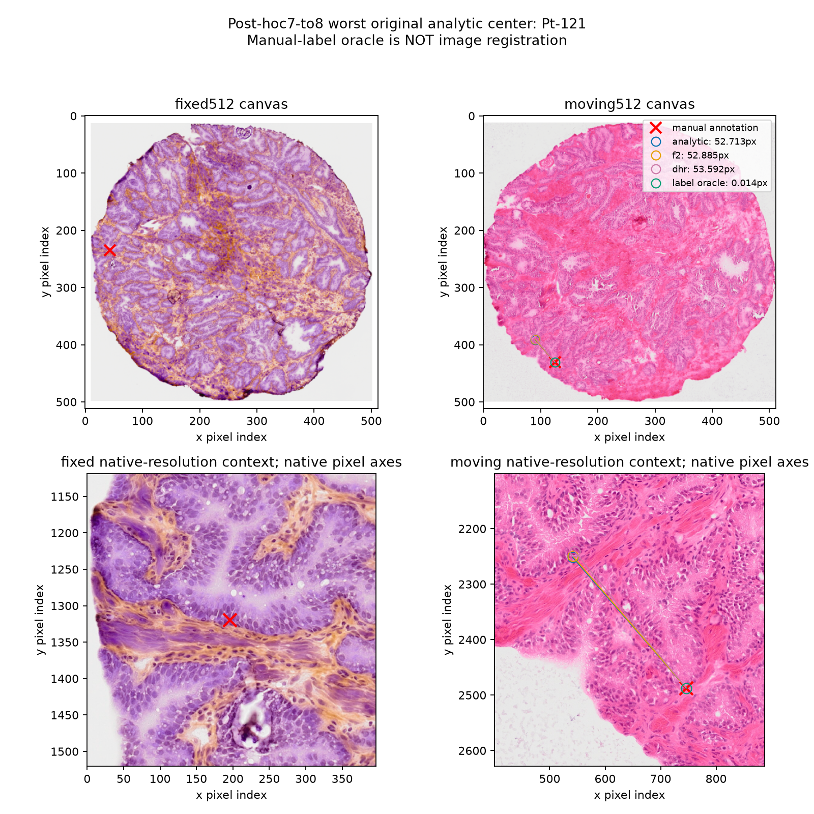

# Can the implemented map class fit the persistent 7-to-8 errors?

## 1. The question and what this experiment is NOT

The original image-driven registration leaves a worst landmark error of about
53 pixels on the known MIIT 7-to-8 section pair. Every target individually lies
inside the output affine polygon, but that does not imply all targets can be
realized simultaneously by our fixed-grid, fixed-boundary map class.

This experiment asks that narrower representational question. It EXPLICITLY
reads manual annotations and is a **label-oracle capacity diagnostic**. It is
not image-only registration, a learned encoder, a held-out test, an inference
score, an initializer, or a training teacher. No oracle output is fed back into
the production registrations. The fit is an additional suffix after the
already computed original registration, not a fresh 300-step registration.

## 2. Inputs, variables, and output map

Let Omega=[0,1]^2. There are N=257 vertices per axis, at
X_ij=(j/256,i/256), including the four corners. The output is a table
Y_ij in R^2 on this SAME source mesh: 66,049 control vertices and 131,072
triangles. Fix each cell's top-left to bottom-right diagonal. Let f_Y be the
continuous piecewise-affine interpolant of Y, denoted P1-ac.

The incoming table Y^0 is the saved ORIGINAL image-only analytic registration,
not identity and not the retired shared-affine feature variant. Its frozen
image-derived affine A in R^(2-by-2) and b in R^2 are preserved as their original
float32 binary values, faithfully promoted to float64 for geometry. The complete
map is F_Y(q)=A f_Y(q)+b. All residual boundary vertices stay exactly at X_ij.

The source images are the published moving section 7 and fixed section 8,
with their original saved 512-canvas layouts. CSV x,y coordinates are interpreted
as zero-based native pixel centers, an explicit convention whose publisher
origin is not independently verified. For native coordinate x along an image
axis, with native size W, actual resized size R and canvas padding p, use

    q=((x+.5)*(R/W)+p)/512.

Apply this separately on x and y using their actual resize factors. There are
124 nominal IDs. A (+inf,+inf) annotation marks absence; the fixed annotation-only
intersection has exactly 107 available IDs, identical to earlier scoring.
All 107 are fitted and scored with equal weight. No large-error point is dropped.
Call their fixed-canvas locations q_k and moving-canvas targets y_k.

## 3. Exact fitting problem and forward decoder

The fitting objective is ONLY

\[
J(Y)=\frac1{107}\sum_{k=1}^{107}\|512\,[A f_Y(q_k)+b-y_k]\|_2^2.
\]

It has units of squared 512-canvas pixels. The root-mean-square error is sqrt(J);
it is not the mean Euclidean error. Images, machine points and distortion priors
do not enter J. They are evaluated separately AFTER fitting as diagnostics.

Require the original exact identity boundary and every cell's four normalized
corner determinants q_j/q_ref>.001, with q_ref=1/256^2. These are twice signed
triangle areas. The four determinants are

    det(b-a,d-a), det(b-a,c-b), det(c-d,c-b), det(c-d,d-a),

where a,b,c,d denote that cell's mapped top-left, top-right, bottom-right and
bottom-left vertices, distinct from the affine translation b above.
These constraints imply a global P1 homeomorphism with the declared boundary.

At one stage freeze its accepted anchor Y. The learnable variable is an interior
scalar coefficient field z_l at level l in {17,33,65,129,257}. Pad it with exact
zero boundary values and interpolate the RAW scalar proposal r=P_l z_l to the
257-square control grid. Interpolating a proposal is not resampling a previously
certified map. For direction e=(1,0) or (0,1), the candidate is

\[
Y'_i=Y_i+\sigma r_i e,\qquad
\sigma=\min(1,.95/g_Y(r)),
\quad g_Y(r)=\max(0,\max_j[-(C_Yr)_j/s_j]).
\]

Here s_j=q_j(Y)/q_ref-.001>0, and C_Y is the exact local linear determinant-change
operator for single-direction motion. Since det(e,e)=0, candidate determinant
slacks are exactly s+C_Y(sigma*r). No global mesh matrix is solved. The derivative
of the active sigma is INCLUDED in autograd; it is not detached.

Use x then y at each of the five levels: ten stages, 30 Adam gradients per stage.
The level-dependent learning rate is .004*16/(l-1), the original physical-rate
recipe. Each stage starts its coefficients at zero and holds its anchor fixed;
trial candidates are not compounded. Evaluate 31 trials to include the final
optimizer step. Select the best finite, actual-strictly-valid J candidate,
including the incoming anchor. There is no stopping or budget expansion based
on anatomical error. Final budget: 300 gradients, 310 decoder trials,
322 J evaluations (initial + ten anchors + trials + final), zero failed trials.

The gradient of J uses a fixed P1 point sampler and the existing safe decoder.
No Jacobian matrix of the full optimizer history is formed or retained.
Local decoder differentiation is distinct from end-to-end encoder training.

## 4. Predeclared witness criterion and actual result

A witness succeeds only if its ACTUAL saved map is valid and EVERY available
center has Euclidean error <=1 canvas pixel. Failure after the one fixed budget
would be inconclusive, not an impossibility theorem.

| Measurement | Incoming original registration | Label-oracle endpoint |
|---|---:|---:|
| Mean Euclidean error, canvas pixels | 3.265901 | .015168 |
| Pair p90 error, canvas pixels | 4.932224 | .021693 |
| Maximum error, canvas pixels | 52.713426 | .026773 |
| Root-mean-square error, canvas pixels | 6.689510 | .016373 |
| J, squared canvas pixels | 44.749548 | .000268082 |

The old worst center Pt121 improves from 52.713426 to .014186 canvas pixels.
Every one of the 107 points meets the criterion. Final minimum normalized
corner determinant is .013077228, strictly above .001; reference and boundary
tables and the original affine are exact. During the recorded fit, 131 trials
activate geometric clipping. This is not a fit performed by ignoring safety.

The saved table is therefore a concrete simultaneous SPARSE capacity witness
for this implemented mesh, boundary and floor. It does not determine true dense
anatomical correspondence between the 107 centers, and does not prove general
capacity on other specimens or convergence of image-only optimization.

## 5. What does the ORIGINAL image objective think of this map?

Evaluate the ORIGINAL full-512 objective only at the incoming and final tables:

    E1 = I + 3 R + .0001 S + .1 M + O.

I is the original transported eight-channel self-similarity image term with its
unchanged fixed foreground mask and denominator. R is cumulative P1 ARAP strain;
S is the original four-corner symmetric-Dirichlet penalty; M is the frozen
image-machine-correspondence robust term using the original 159 raw points,
eligibility/confidence and eight-canvas-pixel scale; O penalizes original moving
image out-of-bounds coordinates. None of these terms is used to fit the oracle.

| Term | Incoming value | Oracle value | Weighted change in E1 |
|---|---:|---:|---:|
| Image I | .368334800 | .375475556 | +.007140756 |
| ARAP R, weight 3 | .002629763 | .063753376 | +.183370839 |
| Shape S, weight .0001 | .022493091 | .862538629 | +.000084005 |
| Machine points M, weight .1 | .026702288 | .224072997 | +.019737071 |
| OOB O | .000730140 | .000729909 | -.000000230 |
| Total E1 | .379626708 | .589959148 | +.210332440 |

About 87.18% of this particular E1 increase is weighted ARAP, 9.38% is weighted
machine evidence and 3.40% is image evidence. The oracle map's residual
vertex-displacement RMS grows from 1.96845 to 6.96629 canvas pixels and its
maximum from 6.88177 to 55.36578 pixels.

This does NOT prove the prior is unreasonable or every accurate map must have
higher E1. A point-only fit may create costly deformation in unobserved regions;
other accurate maps may be smoother. It does show that mere sparse attainability
is insufficient and that this achieved witness is disfavored by the retained
production objective. No regularization-weight sweep follows automatically.

## 6. Runtime, memory, independent checks, and artifacts

The one freshly idle AI RTX A6000 GPU-6 call takes 2.89790 seconds for the fit
interval and 3.74883 seconds end-to-end. Fit timing includes stage construction,
trials, gradients and actual numerical geometry checks; it excludes final
oracle/E1/distortion evaluation and export. End-to-end includes loading/setup
and output checks, but not the already completed initial registration.
Allocated fit peak is 115.065 MiB, including 41.158 MiB resident at fit start
(the full-512 original evidence is already loaded). This is not whole-process
RAM, driver memory, encoder-training memory or a matched speed comparison.

Before real execution, focused author tests and an independent off-node P1
gradient calculation check physical units, original-map start, stage semantics
and counts. The latter's maximum gradient discrepancy is 4.73e-12. Independently
reconstructed original E1 matches the legacy implementation bitwise on synthetic
identity/nonidentity examples.

For the actual result, a separate literal CSV/native half-pixel conversion and
generic 3-by-3 triangle-affine solve reproduce all 107 point errors to 9.98e-13
pixels. All 262,144 saved corner signs, original affine and boundary values are
independently checked. Independent NumPy/PIL descriptor sampling, machine point
evaluation, SVD-based ARAP and explicit matrix-inverse shape evaluation reproduce
nonimage terms to 7e-17 and image costs to 2.98e-8. All ten recorded stage minima
are consistent with anchor-inclusive selection. Intermediate trial arrays were
not archived; their claims are source/record consistency, NOT independent binary
certification of every intermediate table.

Artifacts are the separate files
`outputs/coordinated_instance_registration/miit_7_to_8_label_oracle_capacity_t17.npz`
and its `.json`, generated by `tools/coordinated_miit_capacity_witness.py`.
They are explicitly marked label_oracle and landmarks_used. They are absent
from production prediction manifests and must never be scored as image-only
registration or used as production teachers.

A separately predeclared matched analytic-versus-F2 oracle comparison will ask
whether the coordinated mechanism reaches this known sparse motion more
efficiently. That is a new controlled geometry-efficiency question, not another
budget/weight search and not a production accuracy claim.

## 7. A visual context for the persistent worst center

This POST-HOC illustration selects Pt121 because it is the worst original
analytic error in this pair, not because of its oracle score. Top panels show
the original 512 canvases; bottom panels show native-resolution color image
contexts with native pixel axes. The red cross is the manual annotation.
Hollow circles show original analytic, original F2, unchanged native DHR and
the explicitly labelled oracle. The original three predictions nearly coincide
around 53 pixels from the annotation. The oracle coincides with that annotation
because it was directly fitted to it, NOT because image matching found it.
All plotted original error lengths are checked against the saved score.

The figure makes the location and native tissue context inspectable; it does
not establish that an annotation is mistaken, that either neighborhood is the
true anatomical match, or that the oracle's surrounding dense warp is correct.
No label is relabelled/excluded and no output selection changes. The plot is
reproducible with tools/coordinated_miit_tail_plot.py; it is not another numerical
benchmark or a clinical assessment.

## 8. The predeclared matched-motion attempt, including its failed control

This is a SECOND, different question: how efficiently do the two IMPLEMENTED
mechanisms realize the same large sparse motion when correspondence is given?
The fitting loss J, all107 centers, original incoming analytic257-square table,
original A,b, fixed boundary, P1-ac interpolation and eta=.001 are identical.
No image evidence or prior enters fitting. All runs restart from that same
incoming table; they do not restart from a previous oracle output.

### 8.1 What differs between the two decoders

Analytic uses the scalar decoder of Section3, x then y at each of five levels,
30 gradients per stage. F2 uses the existing production patch decoder, with
TWO cycles of those five levels and30 vector gradients per stage. For F2 the
raw variable z_l has TWO channels. Bilinearly prolong its zero-boundary raw
field to257-square; denote it r_i in R^2. This is proposal interpolation, not
composition/resampling of a certified map. Let c_i count how many of the four
staggered patch passes update interior vertex i. With patch side P=8 cells and
material spacing h=1/256, each pass receives the same calibrated logit

    ell_i = r_i / ((.5*P*h)*max(c_i,1)).

Its suggested vector is d_i=.5*P*h*tanh(ell_i), componentwise. Within a pass,
each nonconflicting patch scales its entire vector suggestion together while
holding that patch's boundary fixed. The four staggered passes run sequentially
on the current table; shared vertices are not duplicated. This is the ORIGINAL
fixed_h F2 mechanism, not a new current-edge or larger-patch variant.

For one affected corner, the determinant along a patch proposal is exactly
a+t*L+t^2*Q. Its conservative adverse-change bound is
B=max(-L,0)+max(-Q,0). The implementation's allowance is
min(.75*a,.95*max(a-floor,0)), where floor=eta*q_ref. It chooses a common patch
scale at most allowance/B over all affected corners, with its existing zero-B
guard and scale cap1. Accepted gain is1. The reserve.95 is explicit.
This protects the real-arithmetic path but does not provide an absolute
floating-point cushion when an existing slack is extremely small.

Both planned schedules therefore contain300 gradients,310 trials,322 J calls,
but they are NOT equal-dimensional or equal-cost operations. Analytic allocates
172,618 scalar coefficients across its ten stages; F2 allocates345,236. One
analytic trial has one geometry pass, whereas one F2 trial has four. These
parameter totals count the SUM across separately optimized stages, not all
parameters simultaneously resident or the number of distinct final vertices.

### 8.2 Threshold and timing, without an error-driven early stop

After each accepted stage, compute ALL107 physical errors. Record the FIRST
accepted stage with maximum<=1 canvas pixel only after actual eta/boundary
checks and filtered-sign binary certification. Copy that vertex table once
to CPU, serialize it in memory and certify it; all that work is INCLUDED in
the reported threshold time. Persist that one snapshot separately afterward.
Ten accepted-stage metric queries and two export metric queries are disclosed,
in addition to J calls. No full optimization trajectory is retained.

Continue the full planned fitting schedule after a threshold is reached.
One warmup per method is followed by the fixed measured order
analytic,F2,F2,analytic. No rate, patch, floor or budget is retuned. All six
attempts are declared pending beforehand and retained, including failures.
The collection is complete, but a FAILED arm is not a completed-budget run.

### 8.3 Actual six-attempt result on the idle A6000 GPU6

| Attempt | Actual gradients / trials / J | Failed trials | Fit seconds | Allocated peak MiB | Final mean / p90 / max pixels |
|---|---:|---:|---:|---:|---:|
| Warm analytic |300 /310 /322|0|3.03928|115.066|.015168 /.021693 /.026773|
| Warm F2, incomplete |180 /190 /202|5|10.50330|378.634|.578565 /.095504 /37.212929|
| Measured analytic |300 /310 /322|0|2.14449|115.559|.015168 /.021693 /.026773|
| Measured F2, incomplete |165 /175 /187|5|8.50380|380.511|.584650 /.061112 /37.484976|
| Measured F2, incomplete |188 /198 /210|4|9.45028|378.634|.554303 /.027693 /37.038191|
| Measured analytic |300 /310 /322|0|2.19696|115.559|.015168 /.021693 /.026773|

All three analytic attempts first meet the certified threshold at stage4
(zero-based),150 gradients/155 trials: maximum about.620375 pixel and minimum
corner ratio.00241128944. Measured threshold times are1.078299 and1.122595s,
including approximately.038716/.041092s of copy/serialization/certification.
Its final maximum is.02677253 pixel. These two samples are descriptive timings
on ONE known task, not a population estimate or an amortized neural inference.

No F2 attempt reaches the threshold. All retain legal endpoints and fit104/107
centers within1 pixel. The remaining Pt121,Pt122,Pt19 dominate squared error;
the worst remains about37 pixels. F2 repeats are not bitwise identical: their
actual counts and maps differ near the strict-floor numerical threshold.

F2's first-cycle accepted slacks become exceptionally small. For measured
attempt3 the minimum ratios at levels17/33/65/129 are
.098625159/.001386472/.001000003251/.001000000000038376.
Second-cycle rejected trials have FINITE loss and coordinates, exact boundary,
but the computed ratio is just BELOW.001. The generic failure message mentions
nonfinite values OR geometry; here it is the geometry-floor branch, NOT a NaN
and NOT an orientation reversal. The actual saved endpoint remains above eta.

Why the reserve is insufficient in this case: one active pass can retain only
.05 times its incoming area slack; four passes can multiply that lower bound
by(.05)^4=6.25e-6. Repeated accepted stages can exhaust a fractional reserve.
The measured attempt3 normalized endpoint slack is3.84e-14, corresponding to
absolute determinant slack about5.86e-19 on this mesh. Coordinate subtraction,
addition and cross-product rounding need not be smaller than that. Real-arithmetic
strict positivity does not imply an implementable absolute separation forever.
No floor relaxation, map repair or replacement run was used to hide this.

The final saved F2 maps have positive EXACT binary-rational gaps above eta:
warm2.31128e-15, measured3 3.83752e-14, measured4 9.85434e-16, in normalized units.
Rejected intermediate arrays were NOT saved; their reported near-floor minima
are source/trace evidence, not independently certified binary counterexamples.
Archived image-only MIIT F2 outputs have minimum ratios around.20 and complete
budgets; this particular numerical failure did not affect those outputs.

### 8.4 Independent recomputation and the conclusion actually supported

A separate checker reconstructs the native coordinates from CSV, evaluates
generic P1 triangles, and checks ALL nine saved tables: six endpoints and three
analytic thresholds. Their2,359,296 corner determinants, boundaries and affines
agree; all107 errors agree within1.06e-12 canvas pixels. Sixteen near-floor
F2 corners are additionally recomputed using exact rational arithmetic on the
stored binary coordinates. Counts/failures are reconciled with all ten stages.

This supports an IMPLEMENTED-PROTOCOL motion-efficiency advantage on one
label-oracle task: analytic attains the stated threshold; F2 does not attain it
before strict-floor rejections and incomplete termination. It is NOT a completed
equal300-gradient accuracy comparison, general F2 incapacity, or an automatic
registration result. There is NO finite time-to-threshold speedup ratio because
the control never reached that threshold. Smaller F2 p90 than its maximum must
not be presented as fitting all centers.

Actual F2 geometry-pass counts are760/700/792, not the planned1240; all ten
stages still allocate the stated cumulative coefficient totals. Peaks include
resident full512 original evidence and are allocator measurements, not process
RSS or encoder training memory. Setup/export scope is unchanged from Section6;
the NEW threshold/metric instrumentation means historical2.8979s is not the
paired baseline. No manual-label output enters production manifests.

Reproducible code is `tools/coordinated_miit_oracle_compare.py` plus the capacity
witness module. The complete attempt collection, per-call reports, all point
errors, final maps and threshold maps are in
`outputs/coordinated_instance_registration/miit_oracle_abba_t18/`.
