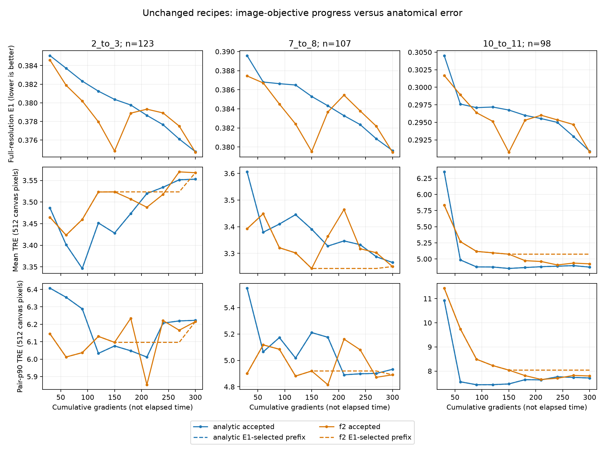

# Coordinated registration: self-contained living research report

This is a working synthesis, NOT the final24-hour review. The authorized window
started2026-10-01 11:26:23UTC and ends2026-10-02 11:26:23UTC. Conclusions below
describe evidence available around T+17h and will be revised after later checks.
The detailed derivations and experiment definitions are in FORMULATION.md;
chronology and negative interventions are in PROGRESS.md. This report introduces
the main objects without requiring knowledge of those earlier discussions.

## 1. What is implemented, and what is not

Implemented: a differentiable local forward decoder which takes learnable
displacement coefficients and an already valid vertex table, and returns another
valid P1 vertex table on the SAME dense source triangulation. Its geometry uses
local determinants and parallel reductions, not inversion of a global mesh
matrix. A sequence of such updates is used for image-driven per-instance
optimization, with actual257-by257 control vertices in the main experiments.

Not established: a newly trained image-to-map neural network, inference-time
anatomical superiority over state-of-the-art registration, clinical validity,
or universal approximation of every digitally admissible homeomorphism by a
particular finite schedule. Local decoder gradient checks do not establish
that a new neural encoder has learned complex registration. Optimizing one
image pair's latent coefficients is a different task from training an encoder.

## 2. Domains, coordinates and the output function

Let Omega=[0,1]^2. Let N be the number of vertices along each axis, with source
vertices X_ij=(j/(N-1),i/(N-1)),0<=i,j<N. The N=257 production lattice has66049
control vertices,65536 quadrilateral cells and131072 source triangles. These
are map degrees of freedom, not merely dense queries of a25-square control map.

For each cell its source vertices are called a,b,c,d in top-left,top-right,
bottom-right,bottom-left order. Fix the a-c diagonal. A P1 map f_Y is the unique
continuous function that maps X_ij to Y_ij and is affine on each of these source
triangles. P1 means degree-one polynomial on each triangle. The connectivity
and source triangulation are fixed even when Y becomes irregular.

The complete image-sampling function is

    F(q)=A f_Y(q)+b0,

where A is a frozen orientation-preserving2-by2 image-derived similarity and b0
is a frozen translation. The residual boundary is Y_ij=X_ij on all four sides.
Hence f_Y maps the rectangle to itself; F maps it onto its affine image, not
necessarily the entire moving-image canvas. The saved archive retains the
residual table and original affine separately. Evaluators apply A exactly once.

An image of width W,height H defines intensities at ((j+.5)/W,(i+.5)/H), its
pixel centers. Map vertices instead lie at endpoints j/(N-1),i/(N-1). Map
sampling is declared P1; intensity/feature sampling is bilinear with explicit
zero padding outside the image. These two interpolation operations are distinct.

## 3. The exact discrete feasibility constraints

For vectors v,w in R^2 define det(v,w)=v_x w_y-v_y w_x. For a mapped cell protect

    q1=det(b-a,d-a),  q2=det(b-a,c-b),
    q3=det(c-d,c-b),  q4=det(c-d,d-a).

Each q is twice a signed triangle area. Normalize by the source value
q_ref=1/(N-1)^2, so the identity has q/q_ref=1. Production requires all four
ratios greater than eta=.001 and an exactly fixed, ordered rectangle boundary.

The four inequalities ensure strict orientation for the triangles of BOTH
diagonal choices. Together with continuous edge sharing and an injective outer
boundary, they imply global P1 homeomorphism for the declared a-c map. A
homeomorphism is a continuous bijection whose inverse is continuous. The same
table also defines a legal quadrilateral-bilinear map, but that is a different
function and is not silently substituted into scoring.

The eta floor excludes some legal maps with tiny positive determinants. In real
arithmetic the formula below preserves that floor; implementation additionally
checks actual rounded candidates and the exported table. Returning the previous
valid anchor after a numerical failure is an explicitly recorded fallback, not
post-hoc fold repair. Native DHR receives no such repair and no global guarantee.

## 4. Coordinated forward updates and their gradients

Fix a current accepted table Y, a direction e equal to(1,0) or(0,1), and scalar
amplitudes u_i at the vertices, with zero boundary amplitudes. Update all interior
vertices simultaneously by Y'_i=Y_i+u_i e. For a triangle(i,j,k),

    det(Y'_j-Y'_i,Y'_k-Y'_i)
    =det(Y_j-Y_i,Y_k-Y_i)
     +(u_j-u_i)det(e,Y_k-Y_i)
     +(u_k-u_i)det(Y_j-Y_i,e).

The quadratic term vanishes because det(e,e)=0. Thus every protected normalized
constraint is EXACTLY s_k+(C_Y u)_k>0, where s_k=q_k(Y)/q_ref-eta is its current
positive slack and C_Y is a sparse local linear operator assembled implicitly
from current edges. No finite-difference approximation of determinant change
is used. The matrix need not be materialized or inverted.

At scale l a learnable scalar coefficient table z_l is interpolated as a RAW
proposal r=P_l z_l on the fixed fine vertices. P_l denotes ordinary scalar
proposal interpolation plus boundary zeroing; it is not resampling an accepted
map or composing maps on an unrelated control grid. Levels are17,33,65,129,257.
The actual output table remains257-square throughout these production stages.

Two entry operators were tested. Define the nonnegative feasibility gauge

    g_Y(r)=max(0,max_k[-(C_Y r)_k/s_k]).

The radial decoder uses u=r/(1+g_Y(r)); then each new slack is strictly positive
for every finite proposal in real arithmetic. Its gauge is positively homogeneous.
For unrestricted scalar amplitudes, this radial transformation reaches every
feasible single-direction displacement u: its inverse is
r=u/(1-g_Y(u)), because feasible u has g_Y(u)<1. This is a statement about the
single-direction feasible set, not a theorem that a fixed finite alternating
network reaches every2D homeomorphism. Coarse P_l may restrict its proposal space.

The production analytic-step operator uses

    sigma=min(alpha_trial,theta/g_Y(r)),  u=sigma r,

with theta=.95 and theta/0 interpreted as infinity. Here alpha_trial=1 for the
ordinary proposal. It leaves at least(1-theta)s_k slack whenever the geometric
bound is active. Both operators are differentiable away from max/min ties;
autograd includes the derivative of the active scale. Detaching sigma would be
a different and generally incorrect gradient. Finite-precision checks and image
accept/reject decisions are separate discrete branches, not claimed globally
smooth operations. Local value/gradient and deliberate failure tests cover the
decoder; a gradient through300optimizer steps is not claimed or retained.

For completeness, with the anchor held fixed and a scalar loss whose derivative
with respect to u is v, the coefficient vector-Jacobian product is

    dL/dz_l = P_l^T [sigma v+(r^T v) grad_r sigma].

P_l^T is the transpose interpolation accumulation. For an active constraint row
c_k of C_Y, radial sigma has grad_r sigma=sigma^2 c_k/s_k. The geometry-limited
analytic scale has grad_r sigma=theta s_k c_k/(c_k r)^2; when the trial limit is
strictly active, that gradient is zero. These formulas apply away from ties;
anchor derivatives additionally differentiate C_Y and s, which ordinary AD
can retain in a neural-layer usage. In the instance optimizer accepted anchors
are intentionally detached between stages. A vector-Jacobian product means
multiplying a scalar-loss derivative backwards through a function's Jacobian,
without storing or forming that entire dense Jacobian.

This is coordinated motion: adjacent vertices may move a long common distance
while their DIFFERENCES, not original mesh spacing, determine admissibility.
A worst active cell can still limit the global scalar scale. This limitation is
measured rather than denied. F2 provides a local-patch comparator under identical
input evidence and objective; it is not automatically worse by construction.

Successive accepted tables are on the same source triangulation. Geometrically,
one can define an affine update h on each current deformed triangle taking its
old vertices Y to its new vertices Y'; then f_Y'=h composed with f_Y EXACTLY.
There is no generic continuous-flow integration followed by uncertified sampled
P1 interpolation. This statement relies on current nondegenerate triangles,
shared-edge consistency and the preserved connectivity.

## 5. What optimization actually consumes

Inputs for one case: fixed and moving images, one common positive image-only
affine, frozen machine-generated correspondence points/confidences, and the
fixed reference mesh. Manual evaluation landmarks are not inputs. The output is
the saved P1 map, its affine factor, explicit geometry certificate, runtime,
gradient/evaluation counts and diagnostics. There is no trained CNN in this phase.

The retained objective is

    E = I +3 R +.0001 S +.1 M + O.

Here are definitions of every term. Convert images to inverted grayscale
intensities G in[0,1]. At each raster scale, use the eight integer offsets
(2,0),(-2,0),(0,2),(0,-2),(2,2),(2,-2),(-2,2),(-2,-2). For each offset a compute
D_a(x), the3-by3 local average of(G(x)-G(x+a))^2, with replicated edge values
for shifting and available-neighbor averaging at pooling edges. Set

    Phi_a(x)=exp[-(D_a(x)-min_b D_b(x))/(mean_b D_b(x)+.0001)].

These eight values are the local self-similarity descriptor (MIND-like here;
not a claim of reproducing every published MIND variant). Compute Phi_f and
Phi_m separately before warping. Let m(x) be the fixed foreground mask: threshold
G_f>.04 at full resolution, area-reduced to lower raster scales. Let Z=sum_x m(x)
on the fixed pixel centers; this denominator is unchanged by the candidate map.
With bilinear zero-padded feature sampling B, define

    I=sum_x m(x) mean_a |Phi_f,a(x)-B(Phi_m,a,F(x))| / Z.

For a source triangle t=(i,j,k), define edge matrices
B_t=[X_j-X_i,X_k-X_i],D_t=[Y_j-Y_i,Y_k-Y_i],J_t=D_t B_t^{-1}.
Only a2-by2 SOURCE edge inverse is involved. The uniform mesh gives equal source
areas, and R=.5 mean_t ||J_t-R_t||_F^2. R_t is the closest orientation-preserving
rotation. Explicitly put a_t=J00+J11,b_t=J10-J01,s_t=sqrt(a_t^2+b_t^2);
then R_t=[[a_t,-b_t],[b_t,a_t]]/s_t. Positive detJ ensures s_t>0. Identity has
zero R; a rigid rotation also has zero R, whereas spatially varying rotations
usually induce stretch. This is an elastic prior, not the topology safeguard.

Let K_l be each of the four2-by2 cell-corner derivative matrices, with first
column equal to the relevant horizontal mapped edge divided by source spacing
and second column the vertical mapped edge divided by spacing. Define

    S=mean_l [||K_l||_F^2+||K_l^{-1}||_F^2-4].

For a2-by2 K with positive determinant, ||K^{-1}||_F^2=||K||_F^2/det(K)^2;
the implementation uses that identity rather than a mesh-system solve. This is
four-corner quadrature, not an exact quadrilateral integral; identity has S=0.

Frozen machine points are(q_j,p_j,c_j): fixed-unit keypoint, affine-aligned
moving-unit keypoint and original confidence. Their original moving location
is A p_j+b0. Statically discard only machine targets outside the original moving
rectangle, never difficult MANUAL evaluation points. Normalize eligible c_j
to weights w_j with sum1. With rho(r)=sqrt(1+||r||_2^2)-1 and kappa=8pixels,

    M=sum_j w_j rho(512 A(f_Y(q_j)-p_j)/kappa).

The translation cancels; A remains in the metric. There is no extra kappa^2
multiplier. Machine confidence is not anatomical ground truth, and no derivative
through keypoint selection/matching is claimed. Finally define componentwise
outside excess t_d(v)=max(-v_d,0)+max(v_d-1,0) and

    O=sum_x m(x) sum_d t_d(F(x))^2 / Z.

Thus out-of-bounds image queries are both zero-padded and penalized, not dropped.
I and O use the current raster scale; M always uses the full512pixel metric;
R and S use the actual fixed fine control mesh. A stage compares its COMPLETE
objective at that stage's raster scale, with all terms and the coefficients
above; it does not compare image loss alone. Accepted stage maps are additionally
scored by the complete512objective for final selection. Consequently the512
objective need not decrease at every lower-resolution stage; best-full selection
retains the best full-resolution accepted output rather than asserting monotonicity.

Each stage freezes its accepted anchor Y while Adam optimizes that stage's z_l.
Trial candidates do NOT accidentally accumulate within the latent solve. Only
a geometry-valid candidate that improves the complete STAGE-objective comparison
becomes the next anchor. The final result is selected by the full512-resolution
objective among accepted maps, never by manual landmark error.

Production analytic: five scalar scales, x/y alternating stages,30Adam steps
per stage,300gradient steps total,310decoder trials,332complete objective calls.
Learning-rate calibration is.004*16/(level-1), in pre-affine normalized units.
F2 uses two five-scale cycles with30steps each for the same300gradients and
has the corrected.95strict-floor reserve. Both start from the same affine plus
identity residual. Native DHR has its own objective/preprocessing and is an
application comparator, not an equal-objective geometry ablation.

## 6. Evidence available aroundT+15h

The lung comparison covers20ordered stain directions from ONE previously viewed
physical specimen, with all80matched manual IDs per direction. Directions and
landmarks are correlated, not20patients or1600independent observations. Errors
below are Euclidean target-registration errors in512canvas pixels, computed
after prediction by an independent P1 evaluator. Mean-p90 means the arithmetic
mean of each direction's90th-percentile error, not the pooled90th percentile.

|Method|Mean direction mean TRE|Mean direction p90 TRE|Output topology|
|---|---:|---:|---|
|Common affine|6.661222|12.234678|Positive affine|
|Coordinated analytic|4.520228|9.555206|Certified P1-ac/all-four corners|
|Corrected full-budget F2|4.551344|9.657840|Certified P1-ac/all-four corners|
|Native DHR|5.133593|11.552831|No hard global guarantee|

Analytic improves mean TRE versus affine in all20directions, but native DHR
wins six direction means, including all fourproSPC-source directions. Analytic's
aggregate advantage over corrected F2 is only0.68%mean and1.06%tail: do not claim
strong anatomical superiority. Native DHR remains much faster in these small
canvas experiments. Clinical competitiveness and unseen-patient generalization
are not established.

Warm complete-call engineering comparisons, with repeatedABBA order, reduce
coordinated runtime by compiling existing ARAP/shape work (about4.05to2.95s on
one known pair) and then by precomputing fixed machine-point triangle indices
and barycentric weights (2.95to2.70s on a second known pair). Map/objective
differences stay at the scale of measured repeat variation, not bitwise identity.
Cold compiler setup is not a speedup. Typical allocated GPU peaks for the main
analytic optimizer are about205--229MB; F2 about495--500MB; native DHR about70--73MB.
These are measured allocated peaks, not whole-process RAM/driver/compiler peaks;
setup/load/export inclusion is specified for each timing experiment.

Strong adverse interventions are retained: more iterations/budget redistribution
can lower the objective while worsening landmarks; removing dense appearance
worsens mean TRE in all20directions; a finite independent-label displacement
prefix improves appearance but raises the complete objective and is rejected
in all six attempted axes. Neither lower proxy loss nor valid topology alone
proves anatomical benefit. Those recipes are retired rather than swept nearby.

Additional prostate transfer now completes after a DISCLOSED image-only
initializer amendment: four right-angle moving views, with original-frame
keypoints and fixed inlier/support/fit ranking, specified before reading manual
coordinates. The original raw-image initializer's two failures remain recorded.
The original assumption that all124labels are finite is also false: the release
uses(+inf,+inf) for absent annotations. Author metric code excludes absent labels.
An explicit source-availability correction, before computing errors, scores ALL
123,107,98both-source-available IDs respectively, identical across methods; all
missing labels and original strict-scoring failures are reported separately.
Finite-point bounds and invalid-prediction guards are not relaxed.

|Method|Prostate equal-pair mean TRE (512px)|Mean pair-p90 TRE (512px)|
|---|---:|---:|
|Common affine|4.904193|8.897884|
|Coordinated analytic|3.897540|6.289528|
|Corrected F2|3.964294|6.381702|
|Native DHR|4.050615|7.181205|

Independent native-frame/CSV/generic-triangle evaluation agrees within1.13e-12px;
actual six safe maps have1,572,864positive corners, minimum ratio.2015743,
exact boundaries/shared affines and all300gradient budgets complete. Native
fields have11506,5271,15158nonpositive corners, retained in scoring. Analytic
improves affine mean/p90 on all three pairs, but loses to F2 on7-to8mean/p90
and to DHR on7-to8p90. Its maximum error is worse than DHR on two pairs; the
7-to8worst error worsens versus affine and remains52.71px. It is not an outlier
cure. Single mean complete calls are4.218s analytic,13.212s F2,.690s DHR;
this is not a paired timing estimate or equal-objective application comparison.
This additional previously used specimen supports bounded development transfer,
not unseen-patient/clinical/general superiority. Details and actual files are in
FORMULATION47, miit_three_rotations_t153/predictions.json and its separately
saved available_landmark_scores.json.

As a bounded post-hoc diagnostic, all123/107/98available targets lie inside
the common affine image rectangle. Their distance-to-range necessary lower
bounds are zero. The worst7-to8target is38.98canvas pixels inside its closest
range boundary despite52.71pixels of registration error. Its error is therefore
not forced by a target outside the decoder's image. This does not establish
that boundary constraints have no other effects or that image evidence is adequate.

## 7. Current interpretation, not final closure

The strongest established result is a scalable, differentiable, no-global-solve
safe update operator plus a useful instance optimizer on the known lung cohort.
The geometry problem is not equivalent to solving arbitrary prescribed
facewise Beltrami coefficients. No Beltrami-recovery objective is required here.
The main unresolved tasks are robust image-derived initialization/evidence,
cross-specimen anatomical usefulness and eventual amortization into a learned
network. The24-hour goal remains active; this document does not mark it complete.

An additional engineering test consolidated detached trial diagnostics into one
CPU transfer while preserving guards and gradients. Despite CPU bitwise checks
and valid28actualGPUoutputs, its paired real timing was not robust: HECC warm
median2.906to2.738s, HEK2.731to2.757s (regression), with~.4swithin-arm ranges.
The predeclared two-pair condition fails; the default remains unchanged. This is
a retained negative result, not a speed benefit. See FORMULATION48.

### 7.1 Why more iterations are not an automatic solution

Six unchanged-recipe MIIT replays save ten accepted maps each. All60snapshots
pass strict geometry checks. Prefix outputs are selected by the complete512
objective E1, never landmarks. On2-to3 the analytic E1 falls.382334to.374758
from90to300gradients, but mean TRE increases3.34619to3.55292pixels. On10-to11,
F2 correctly chooses stage4 by E1 although terminal stage9 has better anatomy.
This is an observed objective-anatomy disagreement, not a prefix-selection bug.
It does not prove optimization globally adequate or image evidence impossible.
Snapshot times include copying overhead; no clean speed claim uses them.
Replays are not bitwise originals: the largest F2 vertex difference is7.72e-5
unit coordinates, although final landmark scores differ by only~4e-8pixels.

Each column is one correlated pair from the same sample. Horizontal axis is
cumulative gradient evaluations, NOT time. Top: complete512E1 of accepted maps.
Middle/bottom: mean/p90TRE; solid is the accepted state, dashed the E1-selected
prefix. All available123/107/98points remain. Different stages use different
coefficient/image resolutions, but the plotted objective is ALWAYS full512E1.
These curves do not authorize TRE-based stopping or early-checkpoint selection.

### 7.2 A feature-frame limitation with an exact controlled example

Our eight MIND-like channels measure directional patch self-similarity.
Under a known affine image transform, both offset directions and patch windows
transform. Merely moving a precomputed descriptor field leaves channel identities
unchanged and is generally not equivariant. For exact90-degree rotation the
necessary correction is a known channel permutation. On an existing512texture,
the uncorrected true-map mean channel error is.26229, while the corrected maximum
is2.22e-16; identity error is zero. A separate independent pixel-loop calculation
confirms the formulas. This isolates a mechanism, not real MIIT causality.
Generic affine transforms need more than channel permutation. Sparse landmarks
also do not define true neighborhood warps. Consequently no registration objective
has been changed on the strength of this control. See FORMULATION50.

A follow-up OFFLINE fixed-affine-frame comparison retains all328available
centers. Raw descriptors prefer the annotated center over the current mapped
center for160IDs; affine-prepared descriptors do so for174. Mean cost ranking
margin changes-.002027to+.008449, but7-to8's mean margin gets worse. All
nominal support flags are valid, and an independent implementation reproduces
every ranking sign. This is weak/mixed representation evidence, not a registration
improvement. It is not a true-neighborhood ground-truth experiment.
The one six-configuration pilot is now complete and independently checked.
Analytic aggregate mean/p90 improves from 3.897540/6.289529 to
3.548752/5.907957 canvas pixels; F2 changes from 3.964294/6.381702 to
3.554328/5.942943. However, BOTH methods worsen 7-to-8 mean, whose maximum
stays around 53 pixels; 120/328 analytic and 118/328 F2 individual errors worsen.
Under the predeclared mixed-result condition the EXACT variant is retired from
main-line adoption, while its positive aggregate evidence is retained. These
same labels influenced choosing it: no untouched confirmation is claimed.
All six 257-square outputs pass strict topology checks, minimum corner ratio
.228070. Serial optimizer calls are about 4.05-5.84 seconds analytic and
12.45-13.55 seconds F2, with allocated peaks about 219-223 and 479-480 MiB;
no paired speed claim follows. See FORMULATION52 for definitions, support
limitations, all pair scores and the archived metadata correction.

The next bounded diagnostic is explicitly a manual-label ORACLE, not registration:
fit ALL 107 available 7-to-8 centers with the same fixed-boundary/affine/257-square
P1 class and exact safe operator, starting from the archived original map.
It tests simultaneous sparse representational capacity, which individual
affine-range inclusion cannot establish. Its map may not be used as production
initialization or a training teacher. The 24-hour goal remains active.
