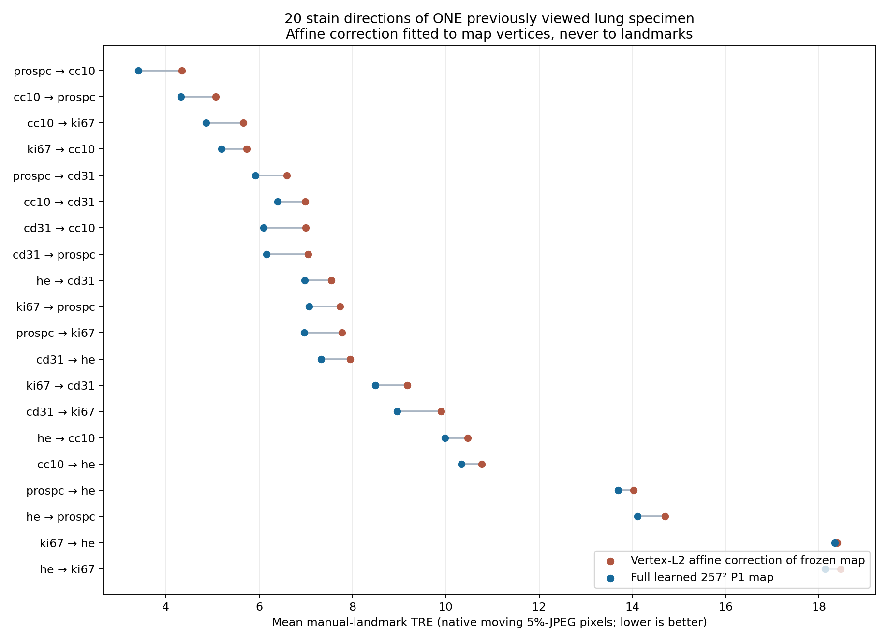

# Phase VI 12-hour extension: what actually improved, and what remains unproved

This is a scientific status note for the user's extra 12-hour research window, not a claim of blind clinical validation. Full mathematics of the retained layer is in [`CURRENT_LEARNED_LAYER_FORMULATION.md`](CURRENT_LEARNED_LAYER_FORMULATION.md); definitions, per-experiment denominators, negative cases and D-drive artifact paths are in [`EXTENSION_IMAGE_REGISTRATION.md`](EXTENSION_IMAGE_REGISTRATION.md) §§5.14–5.35. All manual landmarks below are evaluation-only and belong to previously viewed development examples.

## 1. Exact task and measured layer

Given a 512×512 fixed/moving grayscale pair, an **external** image-derived positive similarity affine, and selected SuperGlue/RANSAC image correspondences, the retained network predicts all 66,049 vertices of a 257×257 aligned deformation table. The rectangle has 131,072 triangles with a fixed diagonal; barycentric interpolation defines the continuous piecewise-affine (P1) map. A frozen global image model and one safe update supply its initial map. A 12-channel, four-pass recurrent U-Net then takes six static Gaussian match fields and six current-map-dependent image-force fields. Each pass proposes a two-component latent displacement at each interior vertex and scales it analytically against all incident signed-area constraints using **current deformed edges**, not the original grid spacing. Boundary vertices remain fixed. The output table is followed by the external positive affine.

The output is not a coarse 17²/49² map later resampled to 257². For each stored binary32 map, exact signs of all **262,144** Q1 cell corners and ordered boundary are rechecked; positive P1 triangles plus the one-to-one boundary yield a P1 homeomorphism of the rectangle. Reverse-mode differentiation traverses the neural map and the *continuous coordinates of already selected matches*, but not SuperGlue's discrete match selection, RANSAC or direct-affine estimation. The optional production-map finite-difference probe is local evidence, not a general smoothness theorem.

Training used 63 ACROBAT image pairs and 18 case-disjoint validation pairs selected by availability of image-only affine, machine matches, frozen map and a 25-step image/match pseudo-teacher. This is only an **eligible subset** of 102 selected source IDs. The loss was `1000 × vertex-map MSE + 0.1 × MIND-like image mismatch + 0.01 × robust selected-machine-match mismatch + 0.2 × displacement strain`, for 1000 minibatches of two. No anatomical landmark was used as a loss or feature. Pseudo-teacher similarity is an amortization metric, not anatomical ground truth.

## 2. Main registration result, with its denominator

On seven already viewed real anatomy pairs, moving-JPEG-pixel mean target registration error (TRE) is the mean Euclidean distance between the predicted position of each fixed landmark and its manually corresponding moving landmark. The lung and BIRL examples use 5% JPEGs; HistoReg CD4→CD68 uses its original-resolution JPEG. The four lung stain pairs have 80 points each; BIRL lesions/kidney and HistoReg have 78/69/77. All methods below use the same pairwise external image-only affine.

| Development pair | Initial affine TRE, px | Prior six-channel dynamic P1, px | Retained 12-channel P1, px |
|---|---:|---:|---:|
| H&E→Cc10 | 11.644 | 10.104 | **9.985** |
| H&E→CD31 | 9.230 | **6.494** | 6.792 |
| H&E→Ki67 | 19.269 | 18.371 | **18.129** |
| H&E→proSPC | 14.970 | 14.380 | **14.106** |
| BIRL lesions | 7.914 | 7.675 | **7.258** |
| BIRL rat kidney | 11.787 | **7.942** | 8.107 |
| HistoReg CD4→CD68 | 41.159 | 22.075 | **21.834** |

These are lower TRE than the initial affine on **7/7** pairs (roughly **6%–47%** relative improvement), but the 12-channel model is **not uniformly better** than the six-channel comparator: CD31 and kidney worsen. We then tested **all 20 ordered stain directions** among five stains of the *same already viewed lung specimen*, one direct affine and one residual match extraction per direction, without omitting failures. Mean native-pixel TRE was **11.6122 affine → 9.3951 frozen P1 → 8.8321 six-channel dynamic → 8.6365 retained 12-channel dynamic**. The retained map beat its frozen starting map and affine on **20/20**, and the six-channel model on **17/20**; its three six-channel losses are explicit in the longer report. All 20 saved retained maps passed the exact binary Q1/boundary audit, with minimum normalized Q1 corner determinant **0.141552**. An independent checker reconstructed all 20 affine/frozen/retained scores from original landmark CSVs to approximately \(10^{-14}\) px. These 20 directions are **one specimen's correlated tissue views, not 20 independent specimens**, and the specimen's labels were exposed earlier in development. The result is valuable development evidence, not blind transfer.

A pointwise post-hoc audit of those unchanged 20 maps found lower error than affine on **1,199/1,600 (74.94%)** correlated direction-point observations and lower error than frozen P1 on **1,006/1,600 (62.88%)**. Affine/frozen/retained median TRE was **9.434/6.681/5.764 px**, with 90th percentiles **22.062/20.049/19.456 px**; 401/594 points still regressed relative to affine/frozen. The same 80 landmark IDs recur across the 20 directions. An independent check reproduced every point from original CSVs to about \(2.1\times10^{-14}\) px.

The retained checkpoint was also actually run and saved on 18 ACROBAT validation IDs from the eligible subset and eight additional ACROBAT confirmation IDs outside all 102 selected source IDs. **26/26** stored 257² maps passed exact topology and improved the image-descriptor proxy over their frozen starting maps; all reported neural image/match/parameter VJPs were finite. The eight have no accessible moving-side manual anatomy landmarks, so their 0.204522→0.185083 image-proxy improvement is **not** an eight-patient TRE result.

## 3. Bottleneck tests, including failures

The following interventions were predeclared in `TOPOLOGY.md`, kept anatomical evaluation separate from inference, and were not selected by a best-of-seven landmark search.

| Hypothesis / intervention | Decisive observation | Interpretation |
|---|---|---|
| Network merely needed 3× more SGD steps | Same architecture at 3000 steps worsened all three 18-case validation map/image/match means versus 1000 steps. | More optimization of this 63-pair setup is not a simple cure. |
| Pseudo-teacher map loss is the sole obstacle | Removing only its coefficient worsened validation map RMSE and image proxy; a different four-coefficient image-heavy run improved proxy but did not improve the 20-direction anatomy mean. | Teacher-map supervision may be imperfect, but that single ablation does not identify it as the main cause. |
| Insufficient simple appearance/spatial variety | Three mild monotone photometric variants worsened map/image means; four exact triangulation-preserving spatial symmetries changed validation image 0.204497→0.204294 but match residual 0.538801→0.552758 and doubled peak training allocation from 4.66 to 10.46 GB. | These particular low-information augmentations did not yield a coherent improvement. |
| A one-step safe machine-match correction should help | Analytic Gaussian residual-match feedback improved selected-match Euclidean error on **26/26** ACROBAT cases, yet worsened their image proxy on **26/26**, with some thinner Q1 corners. | Better fit to one machine proxy is not reliable evidence of better overall registration. No reused anatomy labels were scored for this variant. |
| Fixed rectangle boundary dominates the observed anatomy residual | Near-canvas-boundary matched error was higher (10.859 vs 6.394 px), but affine error rose similarly (14.752 vs 8.589); matched/affine ratios were 0.736 and 0.744. Only four of 1,600 correlated direction-point observations fell within one control-cell width of the actual boundary. | The labels barely probe the boundary and do **not** isolate it as the dominant cause. The fixed-boundary expressivity limitation still exists mathematically. |
| The learned residual is only another affine | Least-squares detrending of the 20 retained-minus-frozen vertex fields assigned **74.21%** of their within-direction squared displacement to a non-affine component on average. | The model demonstrably uses spatially varying geometry; this says nothing by itself about anatomical correctness. |
| The image proxy reliably ranks trained candidates | Twelve-channel versus six-channel maps shared identical affines and frozen starts. Twelve-channel TRE improved **17/20** known-specimen directions while image proxy worsened **16/20**; **13/20** had opposite ranking signs. | The current descriptor proxy is an unsafe stand-in for anatomy-based model selection on this repeatedly viewed specimen. |
| The model simply memorizes its training image proxy | Frozen checkpoint reduced image loss by **0.018354** on 63 training IDs and **0.017498** on 18 internal validation IDs, all output maps certified. | No large train-only proxy gap, but unseen-patient anatomy is still untested. |
| Better anatomy implies better reverse-map consistency | Retained P1 cycle error improved over frozen in **14/20** directions but beat the separate affine inverses in only **2/20**. | One-way topology and lower landmark TRE do not ensure inverse consistency; a bidirectional training/evaluation criterion is a possible next test, not an established fix. |
| Match-loss output gradient dominates, so downweight it | Weighted match output-gradient norm was largest on **18/18** validation maps, but a predeclared 10× lower match weight worsened validation map/image/match means and known-specimen TRE 8.63647→8.67963. | Output-space gradient magnitude is not a sufficient coefficient-design rule; the safe/network Jacobians and information value of matches matter. |

A separate readout-capacity test found that the bilinear cell-to-vertex head is formally full row rank but has one extremely ill-conditioned alternating mode. That subspace contained only **0.0183%** of the 18 held-out pseudo-teacher displacement energy on average. Under identical training from an identical initial output, an additive direct-vertex readout with 1,032 new parameters learned nonzero weights but worsened all four validation means; it was not selected using reused anatomical labels. This is a controlled negative test for this specific architecture, not a proof that high-frequency anatomical motion never matters. Details and the independent projection check are in the longer report §5.24.

Two further diagnostics sharpen the objective question without using manual anatomy. At the 26 retained ACROBAT maps, the image-descriptor and selected-machine-match gradients with respect to the **65,025 interior vertex positions** had mean cosine **+0.0072**, with negative cosine in only **3/26** cases; raw objective gradients are therefore nearly orthogonal on average, not generally opposed. The match gradient touched only **163.4 interior vertices on average**, and that support contained just **1.66%** of image-gradient squared energy. More decisively for the *actual tested update*, the safe Gaussian match-feedback direction increased image loss at unit gain on **26/26**, while lowering robust selected-match loss on **26/26**. Even at gain 0.05, image loss increased on **20/26**. These are proxy-loss and local-update measurements, not landmark outcomes or a proof of universal gradient conflict (§5.26).

We also measured inverse consistency on the already viewed five-stain lung specimen: for all **20 ordered directions**, compose each saved forward map with its independently predicted reverse at a common 65² query grid. On **77,667** accepted correlated direction-query observations, equal-direction mean return error was **2.437 affine, 3.200 frozen P1, 3.144 retained P1** in **512-canvas pixels**. Retained beat affine in only **2/20 directions**, despite its lower anatomical TRE on that specimen. This is an independently recomputed failure mode for inverse consistency, not a contradiction of the exact one-way homeomorphism certificate; the two-map composition is not asserted to be P1 on the original grid (§5.27).

One geometry-only check addresses whether the learned gain is just another affine. At all 257² saved vertices, the retained-minus-frozen increment had mean RMS magnitude **1.486 512-canvas px** across the 20 directions; its orthogonal non-affine component had mean RMS **1.263 px** and accounted for **74.21%** of within-direction squared increment energy on average. Thus the network really uses spatially varying degrees of freedom, although non-affinity itself is not proof of correct anatomy or independent generalization (§5.28).

Finally, the frozen checkpoint was run on **all 63 eligible training IDs**, using the same 257² inference and saved-map certificate as the earlier 18 eligible internal validation IDs. Mean MIND-like image-proxy reduction from the frozen start was **0.018354 on training** versus **0.017498 on validation**, with improvement on **63/63 and 18/18** respectively. All 63 new training maps passed exact saved topology and finite VJP checks. This does not reveal a large train-only gap for this *proxy*; the validation proxies have informed architecture development and do not establish anatomical generalization (§5.29).

A direct retrospective check of the two **already frozen** six- and 12-channel maps found their external affine and frozen P1 start bitwise identical in all 20 directions. Yet the 12-channel model had lower anatomy TRE on **17/20** while its MIND-like image proxy was worse on **16/20**; **13/20** directions combined better TRE with worse image proxy. Equal-direction mean changes, 12 minus six, were **−0.195585 native-pixel TRE** and **+0.0007714 dimensionless image loss**. This does not establish population-level anti-correlation—everything is one previously viewed specimen—but it is direct evidence that the current image proxy can mis-rank anatomically useful learned residuals. The anatomy labels were not used to retrain or select either checkpoint (§5.30).

Scoring both maps on the **same selected machine matches** showed robust match loss lower for the 12-channel model on **20/20** directions (mean **−0.39946 512-canvas px**), including all three directions where its anatomy TRE worsened. This proxy was supplied as a 12-channel network input, so its improvement is not independent evidence of anatomical validity. The three metrics have different units; their numerical magnitudes must not be traded off directly (§5.30).

At the saved 18 internal-validation maps, we also decomposed the *actual weighted training-loss gradient with respect to the 255² interior output vertices*. Mean norm was **0.01949** teacher-map, **0.01511** image, **0.20577** selected-machine-match, **0.02403** strain. The match component was largest on **18/18** cases and exceeded every other term by at least **4.80×**. This makes its small nominal `0.01` coefficient misleading in output-coordinate space, though it does **not** establish dominance after the CNN parameter Jacobian or throughout training (§5.31).

We then ran one predeclared, same-seed 1000-minibatch ablation reducing only match weight `0.01→0.001`. Initial validation rows matched the retained model exactly. On 18 internal validation IDs, teacher-map RMSE, image proxy and robust match loss **all worsened**, while strain improved. On the complete 20 known-specimen directions, the new model's native-pixel mean TRE was **8.67963** versus retained **8.63647**; it won **6/20** paired directions, although both maps beat the common affine/frozen baselines on 20/20. All new maps remained exact-certificate positive, but the minimum normalized corner decreased **0.14155→0.09177**. Independent rescoring from original annotations agreed to about \(2.05\times10^{-14}\) px. Thus simply balancing output-gradient magnitudes did not improve registration, and this single negative ablation prevents promoting gradient norm as a causal tuning rule (§5.32).

A compression diagnostic restricted each **unchanged** retained 257² binary vertex table to nested 129², 65², 33² and 17² subsets, with a new coarse P1 interpolation and its **own** exact topology certificate. All **20/20** directions remained certified at every scale. Known-specimen mean TRE was **8.63647 px** at 257², **8.65274** at 129², **8.69064** at 65², **8.83351** at 33² and **9.20314** at 17². The 65² restriction retains most of the *currently measured sparse-landmark* gain, while 17² loses 0.567 px. This does not establish that a trained 65² network can handle complex unseen dense registration, nor that arbitrary P1 downsampling preserves topology (§5.33).

The match-coverage diagnostic then compared every known-specimen landmark's distance to its nearest selected fixed-side machine match with its frozen-to-retained TRE gain. Pooled nearest-distance quartiles gained **0.919/0.713/0.705/0.698 native pixels** from near to far, but within-direction near-versus-far means were **0.782/0.735**, near won only **11/20** directions, and mean within-direction Spearman correlation was **−0.014**. A simple claim that benefit is confined to match neighborhoods is therefore unsupported; this does not prove the match input is unnecessary or identify an unseen-patient mechanism (§5.34).

Most importantly for the user's “complex registration, not just another affine” concern, we fit the best positive affine **post-map from the frozen to the retained saved vertices**, using all 66,049 vertex pairs but **no manual annotations**. On the same 20 correlated known-specimen directions, mean TRE was **9.39513 px frozen → 9.26721 px affine-corrected frozen → 8.63647 px full learned P1**; full P1 beat that correction on **20/20** directions. The counterfactual is topologically valid as a factorized positive affine composed with the certified **non-affine** frozen map. It depends on the already computed retained map and is **not an independently fast inference baseline**. This demonstrates useful local non-affine variation on this development specimen under the stated vertex-L2 fit; it does **not** prove generalization or optimality against other label-free affine corrections (§5.35).

Thus the most defensible current bottleneck hypothesis is **correspondence evidence / objective mismatch plus limited independent training cases**, not the proven topology mechanism or a demonstrated 257² representation ceiling. This is an inference, not an identified causal law or evidence of gross train-only image-proxy overfitting. In particular, the image descriptor, machine-match objective, inverse consistency and previously scored anatomy do not move together under the tested changes, while the pseudo-teachers themselves are produced from the machine proxies. A genuinely new anatomical cohort is needed before choosing among further appearance models and match-confidence mechanisms.

## 4. Gradients, speed and memory: precise scope

The full four-pass neural map-output gradient was probed on two ACROBAT cases using a Gaussian-weighted **vertex-output scalar**, rather than an image loss with a direct pixel derivative. The trained weights were cast from float32 to float64 for numerical comparison. At the best among tested step sizes, directional AD-versus-central-difference relative errors were roughly **0.01–0.2%** for one selected match target coordinate, **0.09–0.10%** for moving-image pixels, and **0.29–1.08%** for fixed-image pixels. Nonzero paths and both saved exact-Q1 maps were independently checked. One fixed-image difference remained ~1.08% at the smallest tested steps; this and large-step deviations preclude a blanket “all gradients numerically exact” claim. Neither the discrete external matcher nor its affine is differentiable in this pipeline.

The 257² retained model's warm neural **inner** forward was about **59–65 ms** per pair and forward-plus-proxy-VJP about **217–246 ms** on the measured GPU, with maximum PyTorch allocated memory near **1.55 GB** for the VJP. A separate 20-direction wall-clock audit measured a **66.5-ms median residual matcher/RANSAC**, **558.5-ms median entire predictor call** (reloading three checkpoints, warming, forward, backward, save and exact certificate) and **627.5-ms median pair wall time** after a pre-existing direct affine. Matcher checkpoint loading took **1.144 s** once. The direct-affine matcher, raw-slide decoding and any service-level orchestration were not included. The 59-ms inner forward must not be called raw-image end-to-end latency, while the 627-ms prototype call includes work an inference-only service could omit.

## 5. Honest status and next decisive action

We **have** a trainable 257² fixed-triangulation P1-homeomorphism layer with nonzero, locally checked image/match gradients, usable GPU-scale forward/backward, and repeated development-set improvements over a common positive affine and frozen neural start. We **do not** yet have sealed independent-patient anatomical evidence that it learns complex registration reliably. The external initial affine and matcher remain nondifferentiable preprocessing; the published speed numbers must be quoted with their boundaries. No experiment here justifies claiming state of the art or a solved registration problem.

The highest-information next experiment is to freeze the retained checkpoint and acquire a **new patient-disjoint, manually paired pathology cohort** not used to develop this model. Run the full image-only initialization and match selection, save all predictions and exact topology reports before opening target landmarks, then report every eligible and failed case, TRE against the same affine/frozen/six-channel controls, elapsed preprocessing/neural times, and Q1 thickness. The [official ANHIR FAQ](https://anhir.grand-challenge.org/FAQ/) says joining is required to access its data; the eight ACROBAT confirmation cases available here have no accessible target-side manual landmark truth. Until such a cohort is available, further score-driven tuning on the seven/20 already viewed labels would be weak evidence, not progress toward the user's requested generalizable registration network.
